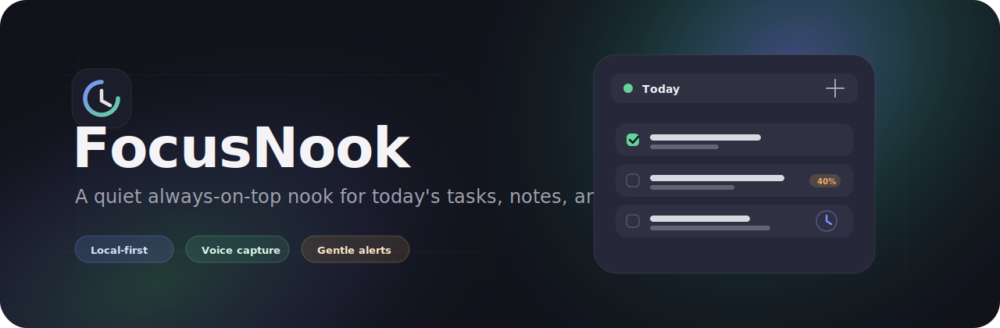

<p align="center">
  
</p>

<p align="center">
  <strong>A calm always-on-top daily planning overlay for tasks, notes, reminders, voice capture, and local-first sync.</strong>
</p>

<p align="center">
  <a href="#status">Status</a> ·
  <a href="#why-focusnook">Why</a> ·
  <a href="#product-scope">Scope</a> ·
  <a href="#architecture">Architecture</a> ·
  <a href="#development">Development</a> ·
  <a href="#license">License</a>
</p>

---

## Status

FocusNook is in **Iteration 0: prototype spike**.

The repository is public so the product direction, technical decisions, and
implementation quality can be reviewed early. The code is not open source and
is not licensed for commercial use, redistribution, or independent forks.

Current focus:

- Windows desktop overlay shell with Tauri 2.
- Transparent frameless window with custom controls.
- Always-on-top / send-back layer switching.
- Global shortcut with fallback.
- Autostart and tray behavior.
- Local SQLite spike.
- Minimal React UI for Today, Notes, and Reminders.
- Android alarm / notification spike planned next.

## Why FocusNook

Most productivity tools ask the user to open a whole workspace, manage projects,
sort priorities, and keep a system alive.

FocusNook is intentionally smaller:

- it sits quietly near the edge of the screen;
- it keeps today visible without becoming the work itself;
- it captures a task, note, or reminder in seconds;
- it works locally first;
- it can sync later without making cloud access mandatory;
- it leaves room for future AI/OpenClaw routing and service summaries.

The product is not a project management suite. It is a small, reliable daily
nook for the things that must stay close.

## Product Scope

### Desktop

- Compact always-on-top Windows window.
- Transparent rounded edges and custom chrome.
- Remembered screen position and layer mode.
- Global shortcut for toggling front/back.
- Autostart with the system.
- Tray-first lifecycle: closing the window should hide it, not kill reminders.
- Today list with task states:
  - open;
  - done;
  - deferred;
  - partially done with percentage.
- Notes tab.
- Reminders tab.
- Reminder alert window with sound and snooze actions.

### Android

The Android app is planned as a full companion application:

- reminders through native alarms and notifications;
- microphone permission only on explicit voice actions;
- voice-to-text capture;
- audio notes;
- background sync through platform-safe scheduling;
- shared domain model with the desktop app.

### Sync

FocusNook is designed as a local-first product with adapter-based sync:

- Google Drive;
- Yandex Disk;
- OpenClaw / OpenClawe adapter;
- optional ProAnima-hosted VDS sync server.

The app core must not depend on a specific provider. Sync is treated as a port,
not as the center of the product.

## Architecture

FocusNook follows a progressive local-first architecture:

```text
UI layer
  React screens, compact widgets, overlay shell, view-models

Application layer
  use cases: create task, update progress, schedule reminder, snooze, sync

Domain layer
  entities, value objects, policies, conflict rules, validation

Infrastructure layer
  SQLite, encrypted vault, OS APIs, Tauri plugins, Android services, sync providers

Server layer
  optional VDS sync relay, auth, device registry, encrypted payload storage
```

The current repository starts with the desktop spike and will grow toward this
layout:

```text
apps/
  desktop/        Tauri 2 + React + TypeScript desktop app
  mobile/         planned Android app shell and native plugins
  server/         planned optional VDS sync relay

packages/
  ui/             planned shared UI primitives and design tokens
  i18n/           planned typed dictionaries and locale tests
  contracts/      planned TypeScript/Rust DTO contracts

crates/
  planner-core/   planned domain model and use cases
  planner-sync/   planned operation log and conflict handling
  planner-storage/planned SQLite repositories and migrations
```

## Technology

Desktop stack:

- Tauri 2.
- Rust.
- React.
- TypeScript.
- Vite.
- SQLite through Rust.

Planned mobile stack:

- Tauri 2 mobile shell where useful.
- Native Android/Kotlin plugins for alarms, notifications, microphone,
  speech-to-text, boot rescheduling, and background sync.

## Repository Layout

```text
.
├── apps/
│   └── desktop/
│       ├── src/              React application
│       └── src-tauri/        Tauri/Rust shell
├── docs/
│   └── assets/               README and brand assets
├── AGENTS.md                 AI-agent engineering contract
├── LICENSE                   restrictive source-available license
└── README.md
```

## Development

Requirements:

- Node.js.
- npm.
- Rust toolchain.
- Tauri platform prerequisites for Windows.

Install and run the desktop app:

```powershell
cd apps/desktop
npm install
npm run tauri dev
```

Frontend-only preview:

```powershell
cd apps/desktop
npm run dev
```

Production build:

```powershell
cd apps/desktop
npm run build
npm run tauri build
```

## Verification

Before considering a change ready:

```powershell
cd apps/desktop
npm run lint
npx tsc --noEmit
npm test

cd src-tauri
cargo clippy --all-targets
cargo test
```

Native overlay behavior must also be checked manually on Windows:

- transparent frameless window;
- drag region;
- always-on-top toggle;
- global shortcut fallback;
- tray lifecycle;
- autostart;
- multi-monitor positioning.

## Privacy And Security Direction

FocusNook is designed around a few non-negotiables:

- local-first data ownership;
- encrypted profile vaults before production sync;
- OAuth tokens stored in OS-backed secure storage;
- no raw task/note/reminder content in crash logs;
- no silent telemetry upload;
- AI/OpenClaw adapters behind explicit user consent;
- strict Tauri capabilities per window.

## Roadmap

### Iteration 0: Prototype Spike

- Desktop overlay shell.
- Layer toggle and global shortcut.
- Tray and autostart.
- Local SQLite spike.
- Minimal three-tab UI.
- Android alarm and notification spike.

### Iteration 1: Local-First MVP

- Profiles.
- Today list with real local persistence.
- Notes.
- Reminders.
- Reminder alert window.
- Local diagnostics.
- Initial i18n structure.

### Iteration 2: Sync MVP

- Operation log.
- Google Drive adapter.
- Yandex Disk adapter.
- VDS sync server.
- Conflict handling.
- Device linking.
- Android background sync.

### Iteration 3: Voice And AI

- Voice capture.
- Speech-to-text.
- Universal quick capture.
- OpenClaw/OpenClawe adapter.
- AI intent confirmation.
- Inbox foundation for future summaries.

## Contributing

Public issues and focused pull requests are welcome at the discretion of
ProAnima Studio.

By submitting a contribution, you agree that ProAnima Studio may use, modify,
publish, distribute, and commercialize that contribution under the terms
described in the license.

Please read [AGENTS.md](AGENTS.md) before making code changes. It defines the
engineering constraints for this repository.

## License

This repository is public but **not open source**.

FocusNook is distributed under the
[FocusNook Source-Available License 1.0](LICENSE).

You may view and privately evaluate the code. You may not use it commercially,
redistribute it, publish independent forks, or create derivative products
without prior written permission from ProAnima Studio.

